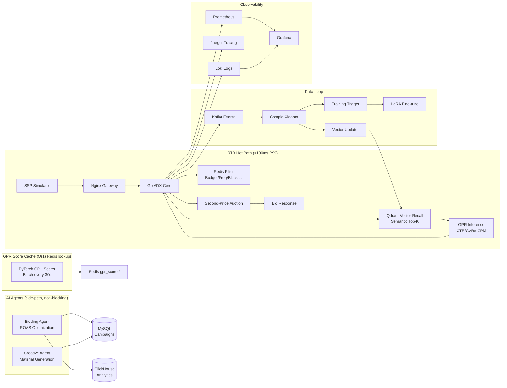

# GPR ADX — Agentic Ad Exchange

> Generative Pre-trained Recommendation (GPR) — a unified LLM-based ad exchange that replaces traditional recall→ranking pipelines with a single model.

## Architecture



## Five-Layer Design

| Layer | Role | Stack |
|---|---|---|
| **1. Access Gateway** | Traffic ingress, rate limiting, OpenRTB 2.5 parsing | Nginx + Gin |
| **2. ADX Trading** | Budget/frequency filtering, vector recall, GPR invocation, auction, A/B routing | Go + Redis + Qdrant |
| **3. GPR AI Sorting** | Hybrid: llama.cpp (agent LLM) + PyTorch CPU batch scorer (Redis-cached) | Qwen2-1.5B + vLLM |
| **4. Data Loop** | Kafka → sample cleaning → LoRA fine-tune trigger → vector index update | Python + Kafka |
| **5. AI Agent Control** | Creative generation + bidding optimization — never in the RTB hot path | LangChain |

## Quick Start

```bash
# Full stack (14 services, requires Docker)
cd deploy && docker compose up -d

# Run traffic simulator
cd sim && go run ssp_sim.go -qps 10 -duration 30 http://localhost:8081/bid

# Unit tests
cd adx && go test ./...
python3 -m pytest agents/ data/ -q
```

## Service Ports

| Port | Service | Purpose |
|---|---|---|
| 8080 | Nginx | RTB entry |
| 8081 | ADX | HTTP direct (debug) |
| 9090 | Prometheus | Metrics UI |
| 9091 | ADX | `/metrics` endpoint |
| 3000 | Grafana | Dashboards |
| 3100 | Loki | Log aggregation |
| 6379 | Redis | Cache + filters |
| 3306 | MySQL | Campaign data |
| 8123 | ClickHouse | Analytics |
| 6333 | Qdrant | Vector search |
| 16686 | Jaeger | Distributed tracing |

## Key Design Decisions

- **No token decoding**: GPR is a discriminative model with structured output heads (CTR/CVR/eCPM), not text generation
- **Second-price auction** with reserve/floor pricing
- **A/B framework**: CRC32 hash-based deterministic routing; control=DeepFM, treatment=GPR
- **Timeout fallback**: GPR timeout → traditional LR scoring (no degradation)
- **Hybrid scoring**: llama.cpp server for agent LLM; `cpu_scorer.py` batch-scores all creatives every 30s → Redis cache → O(1) pipeline lookup
- **All open-source**: no commercial dependencies, privately deployable
