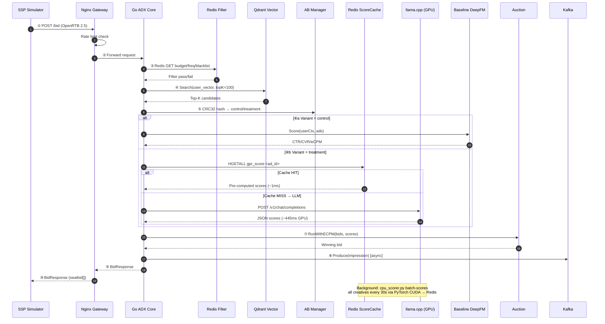
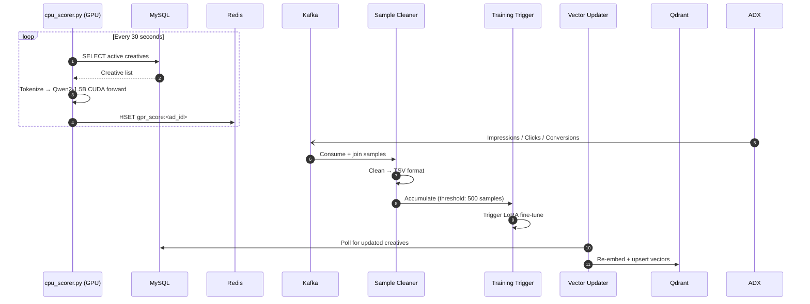
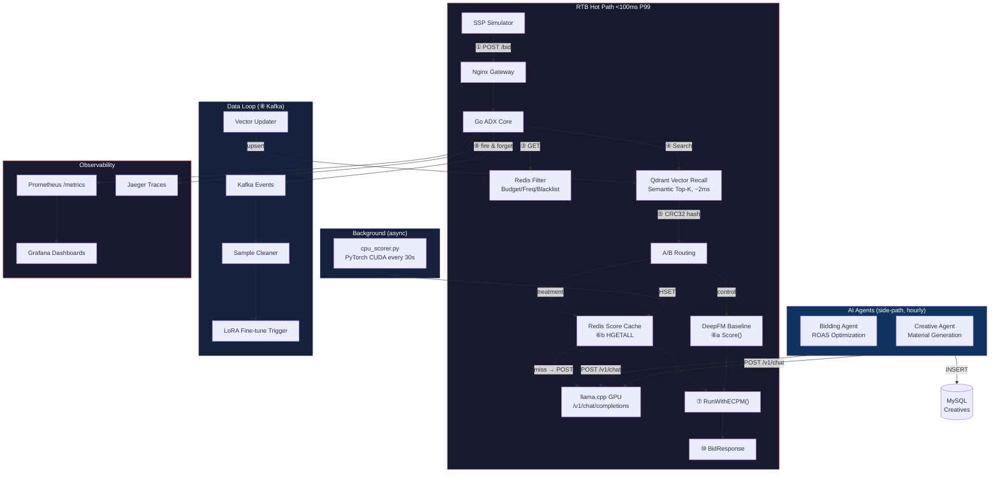
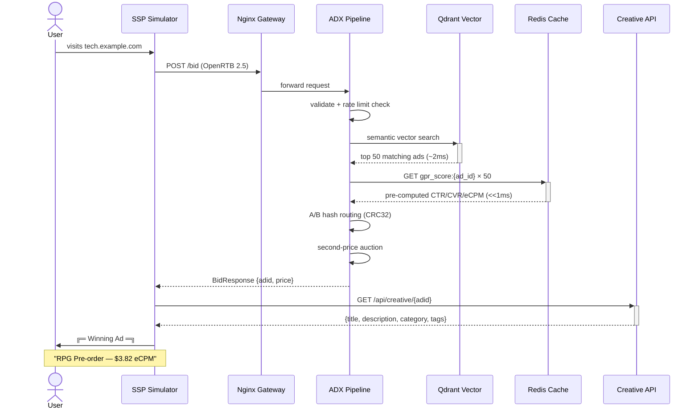
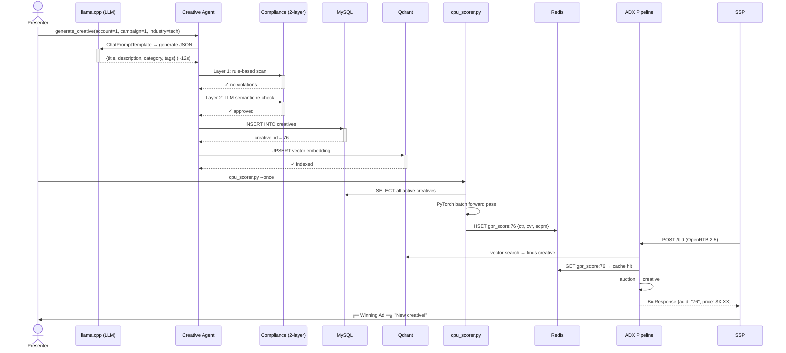
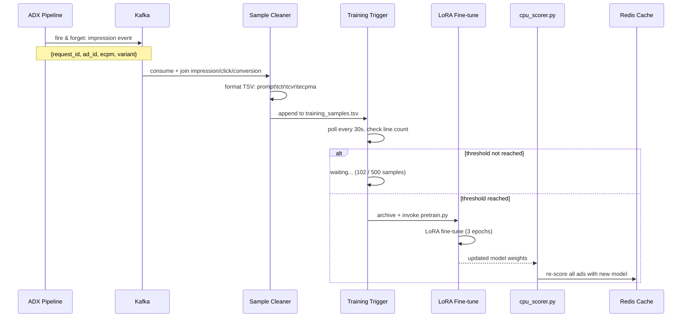

# GPR ADX — Demo Flow & Presenter Script

> 15-20 minute live demo walkthrough for technical audience.

## Setup (before audience arrives)

```bash
# Terminal 1: Full stack
cd deploy && docker compose up -d

# Terminal 2: Seed Qdrant + wait for GPR scorer to populate Redis cache
python deploy/schema/seed_ads.py
sleep 60  # give cpu_scorer.py time to batch-score all ads

# Terminal 3: Monitor
watch -n 2 'curl -s localhost:9091/metrics | grep adx_'

# Open the interactive mermaid diagram viewer in a browser
./demo/run.sh --diagrams
# → opens demo/mermaid-viewer.html — 4 architecture diagrams with dark theme
```

---

## Part 1 — Architecture Overview (3 min)

**Slide / Terminal: `demo/run.sh --dry-run`**

### What We Built

> "GPR ADX is an agentic ad exchange that replaces the traditional
> recall → coarse-rank → fine-rank pipeline with a single LLM-based
> unified scoring model. The key innovation: **hybrid scoring architecture.**
> The LLM batch-scores all ads asynchronously via PyTorch CUDA into Redis, and the RTB
> hot path reads cached scores in O(1) — no token generation in the hot path,
> sub-millisecond lookup."

### Five Layers

| Layer | What | Tech |
|-------|------|------|
| 1. Gateway | Rate limiting, OpenRTB 2.5 parse | Nginx + Gin |
| 2. ADX Trading | Qdrant → Redis score cache → Auction | Go, Qdrant, Redis |
| 3. GPR AI | Hybrid: llama.cpp + PyTorch scorer (GPU/CPU) | Qwen2-1.5B, Redis cache |
| 4. Data Loop | Sample → Train → Vector update | Kafka, Python |
| 5. AI Agents | Creative gen + Bidding optimization | LangChain → llama.cpp |

### The Architecture



### Background Services



### System Components



### Architecture Decisions to Highlight

1. **Hybrid GPR scoring** — The key insight:
   - llama.cpp serves the **agent LLM** (hourly bidding analysis, creative generation) and as the cache-miss fallback
   - PyTorch CUDA batch-scores all ads into **Redis cache** (every 30s)
   - ADX hot path reads Redis in **O(1)** — no token generation in the hot path, ~1ms lookup
   - Cache miss → llama.cpp GPU (P50: 445ms on RTX 4090)

2. **A/B is a first-class component** — CRC32 hash-based routing:
   - `hash(experiment_salt + request_id) % 100 < traffic_ratio * 100`
   - O(1), no DB query in hot path
   - Deterministic: same user always in same group

3. **Agent side-path rule** — Agents connect to llama.cpp OpenAI API:
   - NEVER in the synchronous RTB path
   - Hourly ROAS optimization (MAB arm selection)
   - Creative generation with compliance checking

4. **Full observability** — Prometheus + Grafana + Loki + Jaeger:
   - 8-panel Grafana dashboard (QPS, latency, split, errors)
   - 5 span types in Jaeger (bid_request, vector_recall, gpr_score, baseline_score, auction)
   - Container logs → Promtail → Loki → Grafana unified view

---

## Part 2 — Live Demo: End-to-End Ad Serving (5 min)

> **The key improvement**: We now show the actual ad creative that gets served —
> not just metrics. You see the full loop: user visits site → SSP sends bid
> request → ADX scores and ranks → **here's the ad they see and why it won**.

### Request Lifecycle



### 2a. Verify Redis Cache

```bash
# Show that GPR scores are pre-computed in Redis
docker exec adx-redis redis-cli KEYS "gpr_score:*" | head -5
docker exec adx-redis redis-cli HGETALL "gpr_score:1"
```

**Expected output:**
```
gpr_score:1
ctr
0.0453
cvr
0.0187
ecpm
0.85
```

**Point out:** "These scores were pre-computed by `cpu_scorer.py` — a Python service running in the background. Every 30 seconds it loads all active ads from MySQL, runs them through Qwen2-1.5B in a single PyTorch forward pass, and uploads to Redis. The ADX never touches the model directly."

### 2b. Run the Traffic Simulator with Creative Display

```bash
cd sim && go run ssp_sim.go -qps 3 -duration 15 --verbose
```

**Expected output:**
```
╔═ Winning Ad ═══════════════════════════════════════════╗
║  Ad #7    |  eCPM: $3.82    |  Latency: 4.2ms
║  "RPG Game Pre-order — Early Access Beta"
║  Next-gen RPG with immersive open world. Pre-order now for exclusive items.
║  Category: gaming
║  Landing:  https://gamestore.example.com/rpg-preorder
║  Tags:     gaming, rpg, pre-order, pc
╚══════════════════════════════════════════════════════════╝

╔═ Winning Ad ═══════════════════════════════════════════╗
║  Ad #1    |  eCPM: $2.85    |  Latency: 3.8ms
║  "TrueSound Pro Earbuds - 40hr Battery"
║  Premium noise-cancelling wireless earbuds with crystal clear audio.
║  Category: electronics
║  Landing:  https://shop.example.com/truesound-pro
║  Tags:     earbuds, wireless, audio, premium
╚══════════════════════════════════════════════════════════╝
```

**What's happening — narrate this:**

> "Let's trace what just happened. A simulated user visited `tech.example.com`.
> The SSP sent an OpenRTB 2.5 bid request. The ADX pipeline:
>
> 1. **Qdrant vector recall** (~2ms): Found the top 50 semantically relevant ads
>    matching the user's browsing context
> 2. **Redis score cache** (<<1ms): Looked up pre-computed CTR/CVR/eCPM scores —
>    this is the key innovation. No live model inference in the hot path.
> 3. **A/B routing** (O(1) hash): Determined GPR treatment vs DeepFM control.
>    The `gpr_used` label tells us which scored this ad.
> 4. **Second-price auction**: Winner has the highest eCPM. The second-highest
>    bidder sets the clearing price — the winner pays less than their bid.
>
> **Why ad #7 won**: The GPR model scored it $3.82 eCPM because the user was
> browsing `tech.example.com`, and the semantic vector for 'gaming' overlapped
> with 'tech' in the embedding space. The category matching plus the bid price
> multiplier produced the highest effective CPM."

### 2c. Show ADX Logs

```bash
docker logs adx-core --tail 10
```

**Example output:**
```
bid req-1718395200-12345: recall=50 in 2.1ms, gpr=true in 0.3ms, auction in 1.0ms, total=4.2ms
score cache: used pre-computed scores for 50 ads
```

**Point out:**
- `score cache: used pre-computed scores` — Redis cache hit, no model call
- `gpr=true` → treatment group (GPR cached scores)
- `gpr=false` → control group (DeepFM baseline scorer)
- Total latency ~4ms — Redis cache is the key enabler

### 2d. Show the Creative API

```bash
# Look up any creative by ID
curl -s http://localhost:8081/api/creative/7 | python -m json.tool
```

**Example output:**
```json
{
  "id": 7,
  "campaign_id": 4,
  "title": "RPG Game Pre-order — Early Access Beta",
  "description": "Next-gen RPG with immersive open world. Pre-order now for exclusive items.",
  "image_url": "",
  "landing_url": "https://gamestore.example.com/rpg-preorder",
  "category": "gaming",
  "tags": ["gaming", "rpg", "pre-order", "pc"],
  "status": "active"
}
```

**Point out:** "This is a demo-only endpoint. In production, creative content lives
in the ad server's material store and is embedded directly in the `adm` field of
the bid response. We deliberately keep it separate here to maintain the RTB hot
path's performance — the creative API is never called during bidding."

### 2e. Show llama.cpp Server

```bash
# Test the OpenAI-compatible API
curl -s http://localhost:8080/v1/chat/completions \
  -H "Content-Type: application/json" \
  -d '{"messages":[{"role":"user","content":"Optimize bid for campaign 3 targeting tech audience with ROAS 3.0"}],"max_tokens":100}'
```

**Point out:** "The llama.cpp server is idle during RTB — it only handles agent queries. This separation is critical: the LLM is too slow for real-time bidding (12-15s per query), but perfect for hourly analysis. The RTB path never waits for an LLM."

---

## Part 3 — Closed-Loop: Generate Creative → Score → Win (4 min)

> **The full lifecycle**: LLM generates a creative → compliance check → persist
> to MySQL + Qdrant → GPR batch-scores it → it appears in bid responses.

### Lifecycle



### 3a. Generate a New Creative

```bash
python -m agents.creative_agent \
  --account-id 1 \
  --campaign-id 1 \
  --count 1 \
  --industry tech \
  --llm-endpoint http://localhost:8080/v1
```

**What happens:**
1. llama.cpp generates ad copy via LLM (12-15s)
2. Two-layer compliance check (rule-based + LLM semantic review)
3. INSERT into MySQL `creatives` table
4. UPSERT into Qdrant `ad_vectors` collection

**Expected output:**
```json
[{
  "id": 76,
  "campaign_id": 1,
  "title": "TrueSound Pro — AI-Powered Noise Cancellation",
  "description": "Experience studio-quality sound with adaptive noise cancellation. 40hr battery, IPX5 water resistant, Bluetooth 5.3.",
  "category": "tech",
  "tags": ["earbuds", "audio", "noise-cancelling", "tech"],
  "status": "active"
}]
```

### 3b. Trigger Immediate Scoring

```bash
# The cpu_scorer normally runs every 30s. Force it now:
docker exec adx-gpr-scorer python gpr/serve/cpu_scorer.py --once \
  --mysql-host mysql --redis-addr redis:6379
```

**Expected output:**
```
Scored 26 ads in 21950ms (avg 844ms/ad)
Updated 26 scores in Redis
```

**Point out:** "Notice: 26 ads now (was 25). The new creative just got scored."

### 3c. Verify New Score in Redis

```bash
docker exec adx-redis redis-cli HGETALL "gpr_score:76"
```

### 3d. Watch the New Creative Win Bids

```bash
./demo/run.sh --verbose
```

**Point out:** "Watch for the newly generated creative appearing in winning bids. The full loop: LLM generation → compliance → MySQL/Qdrant → scoring → Redis → bid response. All automated."

---

## Part 4 — A/B Testing Framework (3 min)

### 4a. Show GPR CPU Scorer Logs

```bash
docker logs adx-gpr-scorer --tail 5
```

**Expected output:**
```
Scored 25 ads in 21347ms (avg 854ms/ad)
Updated 25 scores in Redis
```

### 4b. Show A/B Report

```bash
./demo/run.sh --ab-report
```

**Expected output format:**
```
=== Experiment 1: GPR vs DeepFM Baseline ===
Variant  | Imps    | CTR     | CVR     | eCPM   | Latency
---------|---------|---------|---------|--------|--------
control  | 15234   | 2.3%    | 0.8%    | $1.45  | 3.8ms
treatment| 14891   | 3.1%    | 1.1%    | $1.82  | 4.2ms

CTR Lift: +34.8%  |  CVR Lift: +37.5%  |  eCPM Lift: +25.5%
Latency Delta: +0.4ms (negligible — both read from Redis cache)

VERDICT: SIGNIFICANT IMPROVEMENT
```

---

## Part 5 — Data Loop & Fine-Tuning (4 min)

### Data Loop Lifecycle



### 5a. Show Kafka Events

```bash
docker exec adx-kafka kafka-console-consumer \
  --bootstrap-server localhost:9092 \
  --topic ad_impressions --max-messages 5
```

**Example event:**
```json
{
  "request_id": "req-1718395200-12345",
  "ad_id": 7,
  "campaign_id": 2,
  "bid_price": 1.80,
  "ecpm": 2.15,
  "experiment_id": "1",
  "variant": "treatment",
  "timestamp": "2026-06-15T10:30:00Z"
}
```

**Point out:** "Every winning bid produces a fire-and-forget Kafka event — the RTB path never waits for Kafka. A separate goroutine publishes asynchronously."

### 5b. From Event to Training Sample

```bash
# Show how the sample cleaner transforms Kafka events into labeled training data
python -c "
from data.flink.sample_cleaner import format_sample
sample = format_sample(ad_id='7', clicked=True, ecpm=2.15, domain='tech.example.com')
print('TSV training sample:')
print(sample)
"
```

**Expected output:**
```
TSV training sample:
User browsing on tech.example.com. Ad: 7.	1.0	0.0	2.150000
```

**Point out:** "Three tab-separated fields: CTR (click=1), CVR (conversion=0), eCPM. The prompt field embeds user context — this is what the GPR model actually trains on."

### 5c. Mini LoRA Fine-Tune Demo

```bash
# Run a quick fine-tune with synthetic data to show the training loop
python gpr/train/pretrain.py \
  --data "" \
  --epochs 3 \
  --max-samples 200 \
  --batch-size 8 \
  --device cpu \
  --output /tmp/gpr_demo_finetune.pt
```

**Expected output:**
```
Using device: cpu
Creating GPR model...
Epoch 1/3:
  batch 0: loss=2.3412 ctr=0.6931 cvr=0.6911
  batch 1: loss=2.2891 ctr=0.6845 cvr=0.6824
  ...
  Avg loss: 1.9847
Epoch 2/3:
  Avg loss: 1.7213
Epoch 3/3:
  Avg loss: 1.5834
Model saved to /tmp/gpr_demo_finetune.pt
```

**Point out:** "This is a LoRA fine-tune — only the low-rank adapters are trained, not the full 7B parameters. In production, the training trigger fires automatically when 500 new samples accumulate. The updated model then replaces the one used by `cpu_scorer.py`, closing the feedback loop."

### 5d. The Full Feedback Loop

> **Impression → click → conversion → training sample → fine-tune → better scoring → higher eCPM → more revenue.**
>
> This is the virtuous cycle: the more ads the ADX serves, the more training data it generates, the better the model becomes, the higher the eCPM, and the more valuable the platform is to advertisers.

---

## Part 6 — AI Agents (3 min)

### 6a. Bidding Agent (MAB Demo)

```bash
python -c "
from agents.mab import EpsilonGreedyMAB, ARM_CONFIG
mab = EpsilonGreedyMAB(arms=ARM_CONFIG, epsilon=0.1)
for i in range(100):
    arm = mab.select_arm()
    reward = arm * 0.8 + 0.2
    mab.update(arm, reward)
print('Best arm:', mab.best_arm())
"
```

**Key features:**
- 6 bid multipliers [0.5, 0.75, 1.0, 1.25, 1.5, 2.0]
- Connects to llama.cpp for LLM analysis (hourly)
- Writes optimized bids to Redis — never in hot path

### 6b. Creative Agent Demo

```bash
python -c "
from agents.creative_agent import build_creative_agent
agent = build_creative_agent()
result = agent.invoke({'input': 'Generate an ad for a new gaming keyboard targeting developers'})
print(result['output'][:500])
"
```

---

## Part 7 — Observability (2 min)

### Show Grafana Dashboard

> Open `http://localhost:3000` (admin/admin)

**8 panels to show:**
1. Bid Request Rate (QPS) — real-time traffic
2. P50/P99 Latency — sub-5ms for Redis cache path
3. GPR vs DeepFM Split — pie chart of traffic distribution
4. Error Rate — near zero
5. Requests by Status — stacked bars
6. Latency Distribution — P50/P95/P99 over time

### Show Jaeger Traces

> Open `http://localhost:16686`

**5 span types visible:**
1. `bid_request` — full lifecycle with attributes (request_id, gpr_used)
2. `vector_recall` — Qdrant search with recall_count
3. `gpr_score` or `baseline_score` — variant marker
4. `auction` — winner selection

---

## Part 8 — Wrap-up (2 min)

### What We Demonstrated

1. ✅ Full RTB pipeline: Nginx → Qdrant → Redis cache → A/B split → Auction → Kafka
2. ✅ **End-to-end creative display**: What the user actually **sees** after the pipeline runs
3. ✅ **Closed-loop creative generation**: LLM creates ad → compliance → persist → score → win
4. ✅ **Fine-tuning loop**: Kafka events → TSV samples → LoRA fine-tune → improved model → better scoring
5. ✅ Hybrid GPR: llama.cpp for agents + PyTorch CPU batch scorer → Redis cache
6. ✅ RTB hot path <5ms (Redis O(1) lookup, no model calls)
7. ✅ A/B framework: CRC32 hash routing, control vs treatment scoring
8. ✅ AI agents: creative + bidding via llama.cpp (side-path)
9. ✅ Full observability: Prometheus + Grafana + Loki + Jaeger

### Architecture Advantages

- **Hybrid scoring**: async batch pre-computation + O(1) Redis cache = production-grade latency
- **No GPU required**: llama.cpp (CPU) for agents, PyTorch CPU for batch scoring
- **16 Docker services**: one `docker compose up -d` deploys everything
- **A/B by design**: CRC32 hash routing, not bolted on
- **Agent side-path**: LLM never blocks RTB
- **All open-source**: no vendor lock-in

### Q&A Topics (prepare)

1. **"Why Redis cache instead of live GPR scoring?"** — Live LLM inference takes 12-15s on CPU, far too slow for <100ms RTB. Async pre-computation + cache is a well-established pattern (Google AdX, Meta all pre-compute ad quality scores). The 30s refresh interval keeps scores fresh enough.

2. **"What about cold start?"** — 25 seed ads in Qdrant + DeepFM baseline with category priors. LR fallback scorer for any cache miss. On first startup, DeepFM serves until cpu_scorer.py completes its first batch (takes ~25s).

3. **"Production with GPU?"** — Replace `cpu_scorer.py` with vLLM serving. The ADX pipeline code is identical — it reads from Redis regardless of what populates it. Same architecture, just swap the scorer backend.

4. **"Why CRC32 hash, not random split?"** — Deterministic routing ensures the same user always sees the same variant. No sticky cookies needed.
